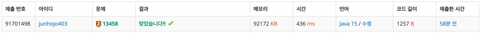

# 백준 시험감독 - Q13458

## 난이도

**Bronze 2**

## 문제

총 N개의 시험장이 있고, 각각의 시험장마다 응시자들이 있다. i번 시험장에 있는 응시자의 수는 Ai명이다.

감독관은 총감독관과 부감독관으로 두 종류가 있다. 총감독관은 한 시험장에서 감시할 수 있는 응시자의 수가 B명이고, 부감독관은 한 시험장에서 감시할 수 있는 응시자의 수가
C명이다.

각각의 시험장에 총감독관은 오직 1명만 있어야 하고, 부감독관은 여러 명 있어도 된다.

각 시험장마다 응시생들을 모두 감시해야 한다. 이때, 필요한 감독관 수의 최솟값을 구하는 프로그램을 작성하시오.

## 입출력 예제

### 입력

첫째 줄에 시험장의 개수 N(1 ≤ N ≤ 1,000,000)이 주어진다.

둘째 줄에는 각 시험장에 있는 응시자의 수 Ai (1 ≤ Ai ≤ 1,000,000)가 주어진다.

셋째 줄에는 B와 C가 주어진다. (1 ≤ B, C ≤ 1,000,000)

### 출력

각 시험장마다 응시생을 모두 감독하기 위해 필요한 감독관의 최소 수를 출력한다.

### 예제


## 풀이

시험 감독 문제는 수학 문제입니다. 몬제에서 요구하는 것은 각 시험장 마다 필요한 감독관의 수를 구하는 것이며 제한 사항은 다음과 같습니다.

1. 총 시험장의 수는 최대 1,000,000개 입니다.
2. 각 시험장의 응시자 수는 최대 1,000,000명 입니다.
3. 총 감독관은 각 시험장 마다 1명씩 있어야 합니다.

위의 제한 사항을 고려 하였을 때 각 시험장 마다 필요한 감독관의 수를 구하는 방법은 다음과 같습니다.

1. 각 시험장의 응시자 수에서 총 감독관이 감시할 수 있는 응시자 수를 뺍니다.
2. 1번에서 구한 값이 0보다 크다면 1번의 값을 부 감독관이 감시할 수 있는 응시자 수로 나눈 나머지를 구합니다.
3. 2번값이 0 이라면 1번값을 부 감독관이 감시할 수 있는 응시자 수로 나눈 몫을 구한 후 1을 더합니다.
4. 2번값이 0보다 크다면 1번값을 부 감독관이 감시할 수 있는 응시자 수로 나눈 몫을 구한 후 2를 더합니다.
5. 1번에서 구한값이 0보다 작다면 부 감독관은 해당 시험장에 필요 없으므로 감독관의 수에 1을 더합니다.
6. 결과를 출력 합니다.

위의 방법을 코드로 구현하면 다음과 같습니다.

```java
import java.io.BufferedReader;
import java.io.BufferedWriter;
import java.io.IOException;
import java.io.InputStreamReader;
import java.io.OutputStreamWriter;
import java.io.BufferedReader;
import java.util.StringTokenizer;

public class Main {

  public static void main(String[] args) throws IOException {
    BufferedReader bf = new BufferedReader(new InputStreamReader(System.in));
    BufferedWriter bw = new BufferedWriter(new OutputStreamWriter(System.out));

    int n = Integer.parseInt(bf.readLine());
    int[] a = new int[n];

    StringTokenizer st = new StringTokenizer(bf.readLine());

    for (int i = 0; i < n; i++) {
      a[i] = Integer.parseInt(st.nextToken());
    }

    st = new StringTokenizer(bf.readLine());

    int b = Integer.parseInt(st.nextToken());
    int c = Integer.parseInt(st.nextToken());
    int r = 0;
    for (int i = 0; i < n; i++) {
      if (a[i] - b > 0) {
        if ((a[i] - b) % c != 0) {
          r += (a[i] - b) / c + 2;
        } else {
          r += (a[i] - b) / c + 1;
        }
      } else {
        r++;
      }
    }
    bw.close();
  }
}
```

## 결과

### 예제 3번

- 입력
  ```plaintext
  5
  1000000 1000000 1000000 1000000 1000000
  5 7
  ```
- 결과  
  

### 최종 결과

